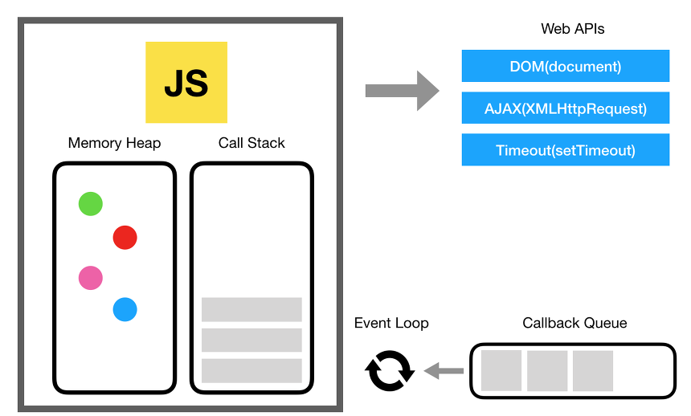
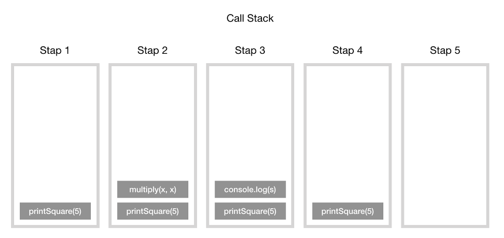
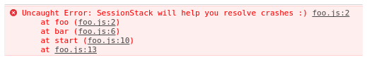
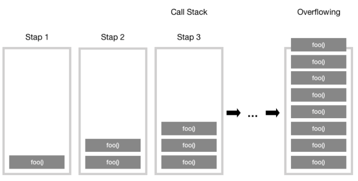
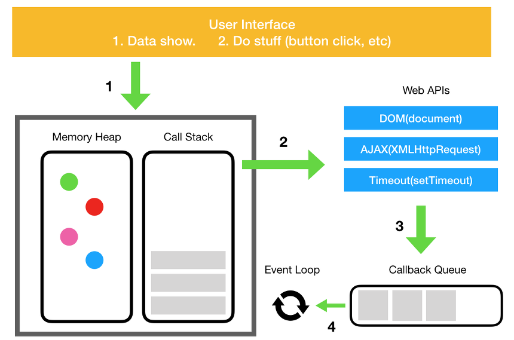
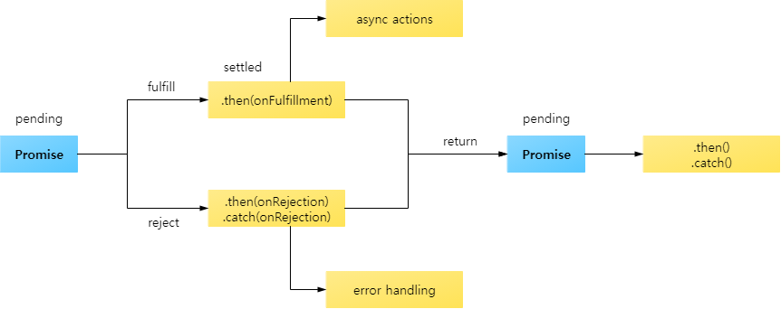

## 1. Javascript 실행순서


### 1. 동기(Synchronous: 동시에 일어나는)

-   요청과 그 결과가 동시에 일어난다는 약속
-   바로 요청을 하면 시간이 얼마나 걸리던지 <code>요청한 자리</code>에서 결과가 주어져야 함
-   <code>순서에</code> 맞춰 진행되는 장점이 있지만,  여러 가지 요청을 동시에 처리할 수 없다.

### 2. 비동기(Asynchronous: 동시에 일어나는 않는)

-   요청과 결과가 동시에 일어나지 않을 거라는 약속
-   하나의 요청에 따른 응답을 즉시 처리하지 않아도, 그 대기 시간동안 또 <code>다른 요청에 대해 처리 가능</code>한 방식
-   <code>여러 개의 요청을 동시에 처리</code>할 수 있는 장점이 있지만 동기 방식보다 속도가 떨어질 수도 있다.

### 3. 동기와 비동기 장단점

-   <code>동기방식</code> 은 설계가 매우 간단하고 직관적이지만 결과가 주어질 때까지 아무것도 못하고 대기해야 하는 단점

-   <code>비동기방식</code> 은 동기보다 복잡하지만 결과가 주어지는데 시간이 걸리더라도 그 시간 동안 작업을 할 수 있으므로 자원을 효율적으로 사용할 수 있는 장점이 있다.

<br/>

## 2. Callstack (호출 스택)



#### 자바스크립트 엔진

브라우저는 DOM, AJAX, setTimeout 등의 브라우저에서 제공하는 Web API, Web API의 호출을 통제하기 위한 Event Queue와 Event Loop도 존재

#### 메모리 힙(Memory Heap)

-   <code>객체는 힙</code>, 대부분 구조화되지 않은 메모리 영역에 할당및 저장
-   <code>변수와 객체에 대한 모든 메모리 할당</code>은 여기서 발생

### 호출 스택(Call Stack)

-   코드가 실행될 때 호출 스택에 함수들이 차례대로 쌓이며 실행
-   자바스크립트는 단일 스레드 프로그래밍 언어, <code>단일 호출 스택</code>은 한 번에 하나의 일(Task)만 처리할 수 있다. (stack은 마지막에 들어온 것이 가장 먼저 처리)

```jsx
function multiply(x, y) {
    return x * y;
}
function printSquare(x) {
    var s = multiply(x, x);
    console.log(s);
}
printSquare(5);
```

-   호출 스택의 각 항목을 스택 프레임이라고 한다.
    

### 예외 처리 시 스택의 동작

예외가 던져질 때 스택의 호출이 어떤 순서로 일어나는지 알려줌

```jsx
function foo() {
    throw new Error('SessionStack will help you resolve crashes :)');
}
function bar() {
    foo();
}
function start() {
    bar();
}
start();
```

-   아래와 같은 순서로 에러가 발생
    

### 스택 오버플로우

택의 사이즈를 초과 했을 때 발생하는 오류, 재귀를 호출했을 때 쉽게 확인 가능

```jsx
function foo() {
    foo();
}
foo();
```


-   호출 스택의 함수 호출 수가 호출 스택의 실제 크기를 초과하게 되고, 브라우저는 다음과 같은 오류를 발생시키는 것으로 함수를 종료 시킴
    
    <code></code>

<br/>

## 3. Callback (비동기 콜백)

### 콜백 함수란 ?

-   비동기 콜백은 일부 코드를 즉시 실행하지 않고 나중에 실행하도록 예약하는 방식
-   이러한 콜백 함수는 특정 이벤트가 발생하거나 일정 시간이 지난 후 실행

### 이벤트 큐와 비동기 콜백의 처리 과정

JavaScript 런타임은 이벤트 큐(Event Queue)를 사용하여 비동기 콜백을 관리합니다. 이벤트 큐는 처리할 메시지와 실행할 콜백 함수들을 저장하는 곳



1. 버튼 클릭, HTTP 요청, setTimeout 등과 같은 이벤트가 발생하면, 해당 비동기 함수는 C++로 구현된 Web API를 호출합니다.
2. Web API는 콜백 함수를 이벤트 큐에 전달합니다.
3. 이벤트 큐는 콜 스택이 비는 시점을 기다립니다.
4. 콜 스택이 비면 이벤트 루프(Event Loop)가 이벤트 큐에서 콜백을 가져와 콜 스택에 추가합니다.
5. 콜백 함수가 실행됩니다.

#### <code>이벤트 루프</code>의 기본 역할은 이벤트 큐와 콜 스택을 지속적으로 모니터링하여, 콜 스택이 비는 시점에 이벤트 큐에서 콜백을 실행시키는 것

<br/>

## 4. Promise

### Promise란?

-   Promise는 비동기 작업의 최종 완료 또는 실패를 나타내는 객체
-   현재는 처리되지 않았지만 미래에 완료될 작업
-   콜백 지옥(callback hell)을 피하고, 더 읽기 쉽고 관리하기 쉬운 비동기 코드를 작성

### Promise 상태 (states)

-   <code>Pending</code>(대기) : 비동기 처리 로직이 아직 완료되지 않은 상태
-   <code>Fulfilled</code>(이행) : 비동기 처리가 완료되어 프로미스가 결과 값을 반환해준 상태
-   <code>Rejected</code>(실패) : 비동기 처리가 실패하거나 오류가 발생한 상태
    <br/>



### 여러 개의 프로미스 연결하기 (Promise Chaining)

```jsx
// then() 으로 여러 개의 프로미스를 연결한 형식
new Promise(function (resolve, reject) {
    setTimeout(function () {
        resolve(1);
    }, 2000);
})
    .then(function (result) {
        console.log(result); // 1
        return result + 10;
    })
    .then(function (result) {
        console.log(result); // 11
        return result + 20;
    })
    .then(function (result) {
        console.log(result); // 31
    });
```

1. 새로운 Promise 객체가 생성되고, 2초 후에 resolve(1)이 호출됩니다.
2. 첫 번째 .then()에서 result 값 1을 받아 콘솔에 출력하고 11을 반환합니다.
3. 두 번째 .then()에서 result 값 11을 받아 콘솔에 출력하고 31을 반환합니다.
4. 세 번째 .then()에서 result 값 31을 받아 콘솔에 출력합니다.

#### .then()은 이전 Promise의 결과를 받아 다음 작업을 처리하고, 최종적으로 원하는 결과를 얻을 수 있습니다.

### 실무에서 있을 법한 프로미스 연결 사례

```jsx
getData(userInfo).then(parseValue).then(auth).then(diaplay);
```

-   위 코드는 페이지에 입력된 사용자 정보를 받아와 파싱, 인증 등의 작업을 거치는 코드
-   userInfo는 사용자 정보가 담긴 객체를 의미하고, parseValue, auth, display는 각각 프로미스를 반환해주는 함수라고 가정

```jsx
var userInfo = {
    id: 'test@abc.com',
    pw: '****',
};

function parseValue() {
    return new Promise({
        // ...
    });
}
function auth() {
    return new Promise({
        // ...
    });
}
function display() {
    return new Promise({
        // ...
    });
}
```

이처럼 여러 개의 프로미스를 .then()으로 연결하여 처리할 수 있습니다.

### Promise.all

모든 Promise가 이행되면 이행되는 Promise를 반환합니다. 하나라도 거부되면 거부된 Promise를 반환합니다.

### Promise.race

가장 먼저 이행되거나 거부된 Promise를 반환합니다.

### Promise.allSettled

모든 Promise가 완료되면 이행되는 Promise를 반환합니다. 성공과 실패 여부에 관계없이 모든 결과를 배열로 반환합니다.

<br/>

## 5. Async, await

-   async와 await는 JavaScript에서 비동기 코드를 동기 코드처럼 작성할 수 있게 해주는 문법
-   이는 코드를 더 읽기 쉽게 만들고, 프로미스 체이닝의 복잡성을 줄이는 데 도움

### Async 함수

-   async 키워드는 함수 앞에 붙여서 해당 함수가 항상 프로미스를 반환하도록 만듭니다.
-   만약 함수에서 명시적으로 프로미스를 반환하지 않더라도, async 함수는 자동으로 프로미스를 반환합니다.

```jsx
async function myFunction() {
    return 'Hello';
}

// 위 함수는 다음과 동일합니다.
function myFunction() {
    return Promise.resolve('Hello');
}
```

### Await 키워드

-   await 키워드는 async 함수 안에서만 사용할 수 있습니다.
-   이는 프로미스가 해결될 때까지 함수 실행을 일시 중지하고, 해결된 프로미스의 결과 값을 반환합니다.

```jsx
async function myFunction() {
    let promise = new Promise((resolve, reject) => {
        setTimeout(() => resolve('완료!'), 2000);
    });

    let result = await promise; // 프로미스가 해결될 때까지 기다립니다.
    console.log(result); // "완료!"
}

myFunction();
```

### 예제: API 호출

```jsx
async function fetchData() {
    try {
        let response = await fetch('https://api.example.com/data');
        if (!response.ok) {
            throw new Error('Network response was not ok');
        }
        let data = await response.json();
        console.log(data);
    } catch (error) {
        console.error('Fetch error:', error);
    }
}

fetchData();
```

await 키워드를 사용하여 fetch 호출이 완료될 때까지 기다리고, 응답이 도착하면 이를 JSON으로 파싱하여 콘솔에 출력합니다. 에러가 발생하면 catch 블록에서 처리됩니다.

### 장점

-   가독성 향상: 비동기 코드를 동기 코드처럼 작성할 수 있어 가독성이 크게 향상됩니다.
-   에러 처리: try/catch 블록을 사용하여 비동기 코드에서도 동기 코드처럼 에러를 처리할 수 있습니다.
-   프로미스 체이닝 감소: .then() 체이닝을 줄여 코드를 더 간결하게 작성할 수 있습니다.
